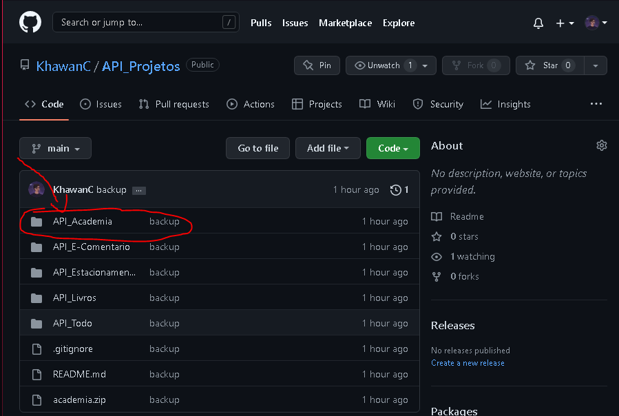
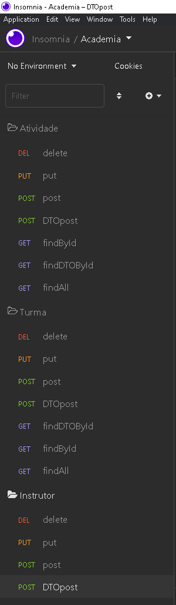
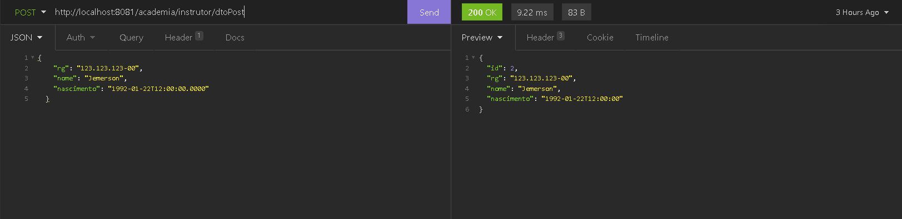
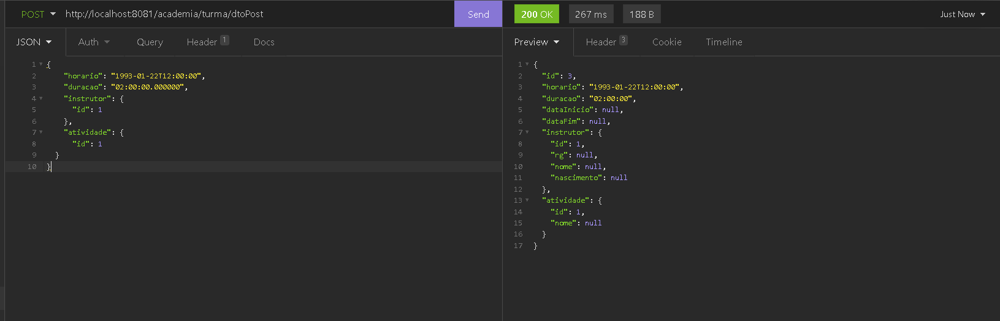
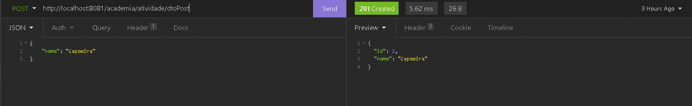

## Avalização 1

Esse ReadMe foi feita para explicar algumas observações sobre o trabalho de API do Serratec.

Neste repositório existem várias pastas de API, porém a utilizada para a avaliação será a pasta API_Academia

Clone o repositorio e extraia a pasta no Spring Boot para visualização do projeto.

Existem algumas observações para se levar em consideração:

1. Existem tratamentos de excessão especificos apenas para o Controller DTO, existem também tratamentos para o Controller "padrão", mas nada muito complexo.
2. Existem configurações específicas para os posts JSON no Insomnia, isso se dá por conta do uso do LocalDate e LocalDateTime em algumas variáveis por conta de uma função/trigger feita no Postgresql para inserção automática de alguns campos, por tanto respeite a formatação.
3. Por consequência da função/trigger feito no Postgresql, foi criado uma exception que impede a inserção do campo "dataInicio" e "dataFim" em Turma, isso não é um erro e sim uma feature do sistema.

-----------------------------
Exemplo de end points possíveis do Insomnia

-----------------------------

Exemplo de Post no Instrutor (pelo DTO)

-----------------------------

Exemplo de Post na Turma (pelo DTO)

-----------------------------

Exemplo de Post na Atividade (pelo DTO)

